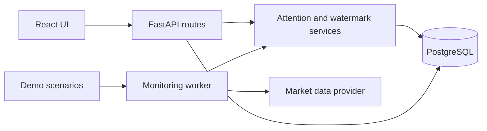

# Smart Market Watchlist

An attention engine that identifies meaningful market changes, explains why they matter, and tracks what happened since the user last checked.

## Local Development

The application uses PostgreSQL. Copy `backend/.env.example` to `backend/.env` and set a local PostgreSQL connection string before initializing the schema.

```powershell
Set-Location backend
python -m pip install -r requirements.txt
python -m app.database.init_db
python -m app.database.seed_demo
python -m pytest -q
python -m uvicorn app.main:app --reload
```

In another terminal:

```powershell
Set-Location frontend
npm install
npm run dev
```

Open `http://localhost:5173`. The API runs at `http://localhost:8000`.

## Architecture



The backend is the source of truth for attention scoring, explanations, significant-event lifecycle, and read state. The frontend renders those decisions through TanStack Query and never creates or re-scores events.

## Deterministic Demo

Open `http://localhost:5173/changes` and use **Hackathon demo** to run a scenario for any watched stock. Each trigger sends one exact market point through the normal backend pipeline:

`MarketDataProvider -> SignalEngine -> EventManager -> PostgreSQL`

- **Normal movement** stays quiet and creates no unnecessary event.
- **Price shock** produces a high-attention event with price, volume, and benchmark-relative explanations.
- **Volume anomaly** exposes the volume signal without artificially forcing an event.
- **Relative performance** explains movement against the benchmark.
- **Stale market data** is visibly stale and cannot create a significance event.

After a price shock, the new item appears at the top of **What changed?**. Use **Mark all [symbol] updates seen**, then reload the page to demonstrate that read state persists in PostgreSQL. Demo endpoints return `404` when `ENVIRONMENT=production`.

### Two-minute demo story

1. Open the watchlist to show ordinary market data without unnecessary alerts.
2. Open **What changed?** and run **Normal movement** for TCS; no event is created.
3. Run **Price shock** for TCS; high attention appears with a plain-language explanation.
4. Mark all TCS updates seen and reload; the PostgreSQL watermark keeps them dismissed.
5. Run **Stale market data** to show that unreliable data is labeled and cannot create an event.

## Windows ARM64

The pinned `psycopg[binary]` release does not provide a Windows ARM64 wheel. Use x64 Python under Windows emulation for the backend:

```powershell
Set-Location backend
& "$env:LOCALAPPDATA\Programs\Python\Python312-x64\python.exe" -m venv .venv-x64
& ".\.venv-x64\Scripts\python.exe" -m pip install -r requirements.txt
& ".\.venv-x64\Scripts\python.exe" -m app.database.init_db
& ".\.venv-x64\Scripts\python.exe" -m app.database.seed_demo
& ".\.venv-x64\Scripts\python.exe" -m pytest -q
& ".\.venv-x64\Scripts\python.exe" -m uvicorn app.main:app --reload
```

This workstation uses PostgreSQL 17 binaries in `%LOCALAPPDATA%\Programs\PostgreSQL\17` and its data cluster in `%LOCALAPPDATA%\SmartMarketWatchlist\postgres-data`.

Start that user-local database after a reboot with:

```powershell
& "$env:LOCALAPPDATA\Programs\PostgreSQL\17\bin\pg_ctl.exe" `
	-D "$env:LOCALAPPDATA\SmartMarketWatchlist\postgres-data" `
	-l "$env:LOCALAPPDATA\SmartMarketWatchlist\postgres.log" -w start
```
