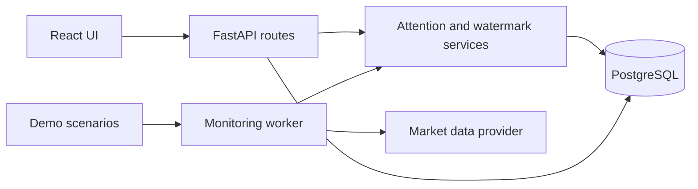

# Smart Market Watchlist

An attention engine that identifies meaningful market changes, explains why they matter, and tracks what happened since the user last checked.

## Local Development

Requirements:

* Python 3.12
* Node.js LTS + npm
* PostgreSQL 17

Create a PostgreSQL database named `smart_market_watchlist`.

Copy `backend/.env.example` to `backend/.env` and add your local PostgreSQL password.

In the `backend` folder, run:

```powershell
python -m venv .venv
.\.venv\Scripts\Activate.ps1
pip install -r requirements.txt
python -m app.database.init_db
python -m app.database.seed_demo
python -m pytest -q
python -m uvicorn app.main:app --reload
```

In another terminal, open the `frontend` folder and run:

```powershell
Copy-Item .env.example .env.local
npm install --legacy-peer-deps
npm run dev
```

Open `http://localhost:5173`. The API runs at `http://localhost:8000`.

## Architecture



The backend handles attention scoring, explanations, event lifecycle, and read state. The frontend displays these results.

## Demo

Open `http://localhost:5173/changes` and use **Hackathon demo** to try different market scenarios.

* **Normal movement** stays quiet without creating an unnecessary event.
* **Price shock** creates a high-attention event with an explanation.
* **Volume anomaly** demonstrates unusual trading volume.
* **Relative performance** shows movement compared with the benchmark.
* **Stale market data** shows how outdated data is handled safely.

After a significant event appears, mark it as seen and reload the page to see that the read state is preserved.

## Two-minute Demo Story

1. Open the watchlist and show the monitored stocks.
2. Open **What changed?** and run **Normal movement** for TCS.
3. Run **Price shock** for TCS and show the resulting high-attention event.
4. Open the stock details to show why the event was highlighted.
5. Mark the TCS update as seen and reload the page.
6. Run **Stale market data** to show the stale-data warning and safe handling.

## Tech Stack

Frontend: React, TypeScript, Vite

Backend: Python, FastAPI, SQLAlchemy

Database: PostgreSQL

Testing: Pytest, Vitest
